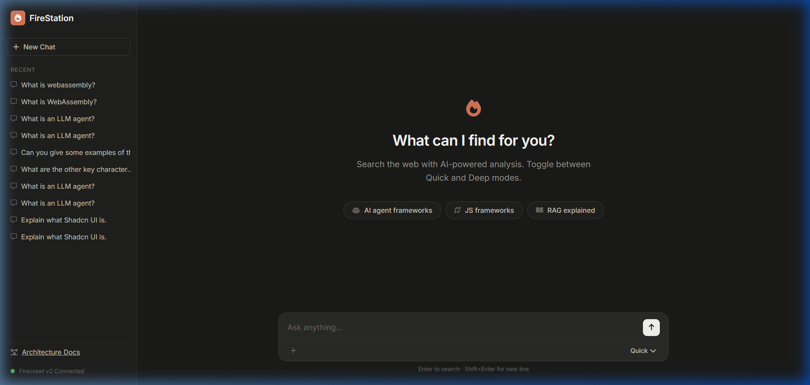
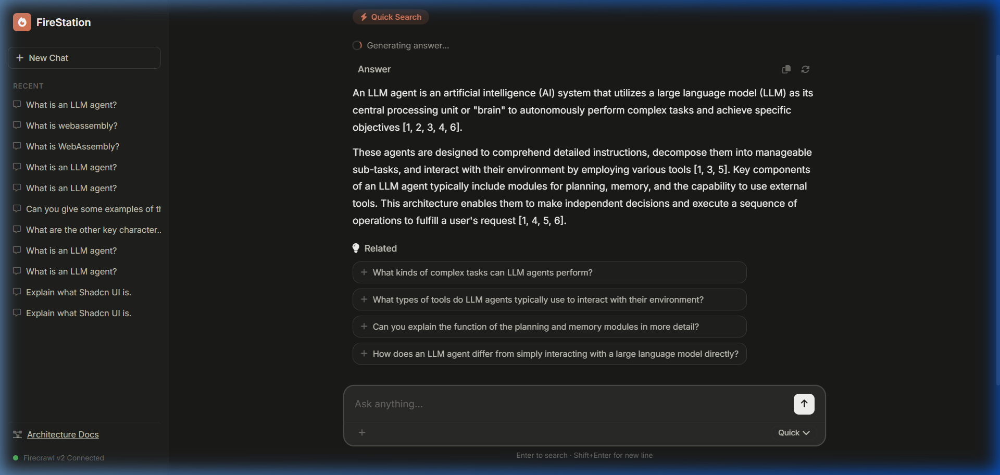
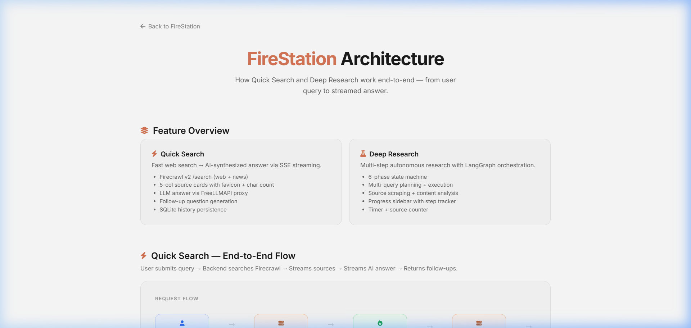

<div align="center">
  
  <h1 align="center">FireStation AI Research</h1>
  <p align="center">
    <strong>A high-performance, autonomous AI research assistant powered by Firecrawl & FreeLLMAPI.</strong>
    <br />
    Includes Quick Search streaming, Deep Research multi-agent workflows, and a premium Light/Dark UI.
  </p>

  <p align="center">
    <a href="https://github.com/Hoanganhvu123/AI_search_with_firecrawl/stargazers"></a>
    <a href="https://github.com/Hoanganhvu123/AI_search_with_firecrawl/network/members"></a>
    <a href="https://github.com/Hoanganhvu123/AI_search_with_firecrawl/issues"></a>
  </p>
  
  <p align="center">
    <a href="https://paypal.me/hoanganhvu933" target="_blank">
      
    </a>
  </p>
</div>

---

## 📸 Previews

### 1. Command Center (Empty State)


### 2. Streaming Chat & Search Results


### 3. Architecture & Data Flow


---

## ⚡ Features

*   **Quick Search**: Real-time web search combined with LLM synthesis, streamed instantly via Server-Sent Events (SSE).
*   **Deep Research**: Multi-step LangGraph autonomous agent. It understands the query, plans sub-queries, searches, scrapes, analyzes, and synthesizes.
*   **Premium UI**: A polished, clean interface inspired by modern AI apps (Fireplexity/Claude). Supports both Light and Dark themes, 5-column source cards, and a live progress tracker.
*   **Unified Proxy**: Powered by `FreeLLMAPI` to route traffic securely across various models (Gemini, Groq, Mistral, etc.) with automatic failover.

---

## 🚀 Quick Start

### 1. Requirements
*   Python 3.10+
*   Node.js (for FreeLLMAPI proxy if running locally)

### 2. Installation
```bash
git clone https://github.com/Hoanganhvu123/AI_search_with_firecrawl.git
cd AI_search_with_firecrawl/backend

# Install dependencies
pip install -r requirements.txt
```

### 3. Environment Variables
Copy the example environment file and fill in your keys:
```bash
cp .env.example .env
```
*(Open `.env` and configure your `FIRECRAWL_API_KEY` and proxy endpoints).*

### 4. Run the Server
```bash
python server.py
```
*   **UI:** [http://localhost:5000/firecrawl/ui/index.html](http://localhost:5000/firecrawl/ui/index.html)
*   **Architecture Docs:** [http://localhost:5000/firecrawl/ui/docs.html](http://localhost:5000/firecrawl/ui/docs.html)

---

## 🛡️ Security & Best Practices (OWASP LLM Compliant)

**WARNING: AI Agents and Git ignore files are NOT enough to protect your secrets.**

Based on the [OWASP Top 10 LLM Risks](https://owasp.org/www-project-top-10-for-large-language-model-applications/) and real-world incidents (like the PocketOS database wipe), this project adheres to strict security layers:

1.  **No Secrets in Workspace**: Never store production secrets in the workspace. `.env` is explicitly ignored in `.gitignore`.
2.  **Dummy Test Keys**: We use `.env.example` with dummy values. Even if an AI agent captures terminal output containing a key, it will only be a dummy key.
3.  **Terminal Output Protection**: We ensure the backend code **never** logs API keys or Database strings to stdout/stderr. AI agents reading terminal logs cannot capture credentials.
4.  **Local SQLite Isolation**: The `*.db` and `*.sqlite` files are ignored by git. The application auto-initializes the schema on startup via `init_db()`.
5.  **Pre-commit Scanning**: We strongly recommend using **Gitleaks** or **TruffleHog** as a pre-commit hook to catch any accidental secret injections.

> *Relying solely on `.gitignore` is a soft policy. True security requires technical hard barriers (secret managers, log redaction, network policy).*

---

## 🏗️ Architecture

Read the full interactive flow diagrams on our [Architecture Docs Page](http://localhost:5000/firecrawl/ui/docs.html) (included in the app).

*   **Frontend**: Vanilla HTML/JS + CSS variables (No build step required, minimal latency).
*   **Backend**: FastAPI serving static files and SSE endpoints.
*   **Database**: SQLite (`firecrawl_history.db`) automatically generated locally.
*   **Engine**: Firecrawl API (v2) for Web/News Search + Scrape endpoints.

---

## 🤝 Support the Project

If you find this useful, consider buying me a coffee (or a server!). I'm currently broke and trying to keep the servers alive.

<div align="center">
  <a href="https://paypal.me/hoanganhvu933" target="_blank">
    
  </a>
  <p><em>Thank you for your support!</em></p>
</div>
